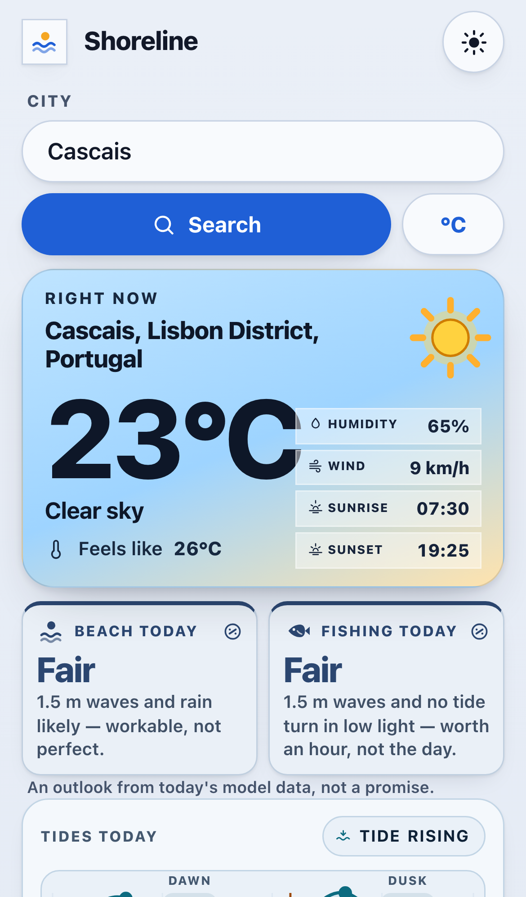
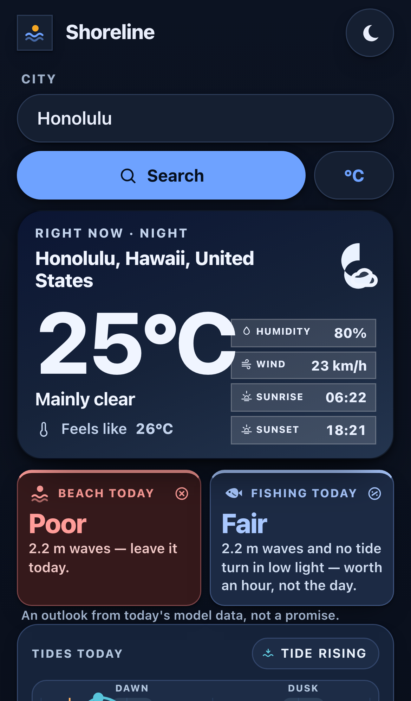
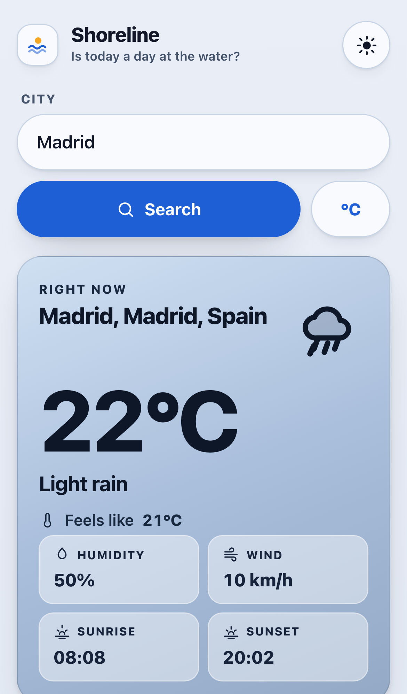
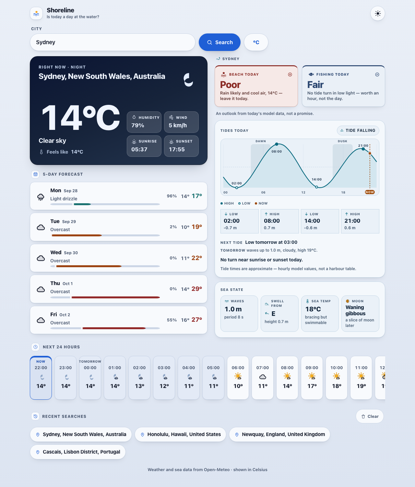

# Shoreline

**Is today a day at the water?** Shoreline is a mobile-first web app for beach-goers, swimmers and anglers. Search a coastal town and the first screen tells you whether today is Good, Fair or Poor for the beach and for fishing, and why, in plain words. Below that come today's tides on a chart with dawn and dusk marked, the sea state (waves, swell, water temperature), the moon, and the weather around it all. Inland places get a clean weather app with nothing about the sea.

> **Not a line of this app was written by a person.** Shoreline was built from scratch by a local open-weights model, Qwen3.8-Flash-Next, running unattended on one NVIDIA DGX Spark inside [**dgx-autonomy**](https://github.com/EduardKakosyan/dgx-autonomy), a self-governing build loop. Briefs and product reviews came from a person and a supervising Claude session; the first brief was drafted in a planning session with the same local model. The builder wrote, tested, designed and committed every one of the 42 commits in this history on its own, across three runs between 24 and 28 September 2026.

<p>
  
  
  
</p>


## What it does

- **Beach and fishing verdicts.** Good, Fair or Poor for today, following fixed, published rules: waves, wind, rain, thunder and air temperature for the beach, and a tide turning in the dawn or dusk light for fishing. Each verdict gives a reason like "1.6 m waves and no tide turn in low light — worth an hour, not the day."
- **Tides.** Today's highs and lows with times and heights, whether the tide is rising or falling now, the next turn (tomorrow's if today's are done), and a chart with now, the turns, and the dawn and dusk windows.
- **Sea state and moon.** Wave height and period, swell direction, sea temperature ("bracing but swimmable"), and the moon phase.
- **Weather.** Current conditions in a hero card that follows the sky by day and night, a 24-hour strip, and a 5-day forecast.
- **The rest.** °C/°F (the sea section converts too), light and dark themes, recent searches, and phone and desktop layouts. It stays keyless: the browser calls the free [Open-Meteo](https://open-meteo.com) geocoding, forecast and marine APIs directly.

## Run it

It's a static site with no build step:

```sh
node tools/serve.js          # http://localhost:3000
```

The frozen acceptance checks run against it (Playwright; the Open-Meteo hosts are intercepted with fixtures, so no network is needed):

```sh
npm install && npx playwright install chromium
APP_URL=http://localhost:3000 npx playwright test
```

## How it was built

The builder is Qwen3.8-Flash-Next, served locally with SGLang (llama.cpp for run 1). It works in an OpenHands sandbox container on the DGX Spark. The sandbox is cut off from the host and the local network. Nobody answers its questions. The loop around it does the rest:

1. **A brief and frozen checks.** Each run starts from a written brief plus executable acceptance checks, frozen at launch. The builder can read them and cannot change them.
2. **The builder works alone.** It plans, codes, runs the checks and its own audit scripts, looks at screenshots of its own UI, and commits. When its context fills up, it writes a handoff and continues in a fresh conversation. The Shoreline run did that five times.
3. **Independent evaluation.** When the builder says it's done, the environment runs the frozen checks in separate containers against the running app. A claim counts only if they pass.
4. **Product review, never code review.** The operator acted as a product lead. Opening the live demo on real data, they sent feedback about what a user sees and feels. They never touched or commented on code. Those messages are the only input the builder got after launch.

| Run | Brief | Builder model | Outcome |
|---|---|---|---|
| [1: Weather Now](loop/runs/1-weather-now/) | A polished mobile-first weather app | qwen3.8-flash-next (llama.cpp) | 15/15 checks; stopped to switch the backend to SGLang |
| [2: Weather Now, polished](loop/runs/2-weather-now-polish/) | The same brief, continued with the operator's review | qwen3.8-flash-next-sglang | 15/15 checks after two review rounds |
| [3: Shoreline](loop/runs/3-shoreline/) | Turn it into a companion for a day at the water | qwen3.8-flash-next-sglang | 19/19 checks after one review round; **accepted** |

Each run's folder in [`loop/runs/`](loop/runs/) holds its frozen brief, its acceptance checks, and every word the operator sent the builder. `AGENTS.md` and `audit/` are the builder's own notes and the verification scripts it wrote for itself. The git history is the builder's, unedited, apart from the last commit, which added this README and the loop record.

## Part of the dgx-autonomy project

Shoreline is the first app built end to end in [**dgx-autonomy**](https://github.com/EduardKakosyan/dgx-autonomy). See that repo for how the loop works and for the other projects built in it.
